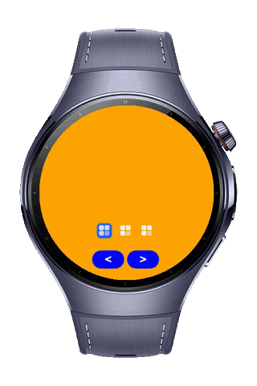
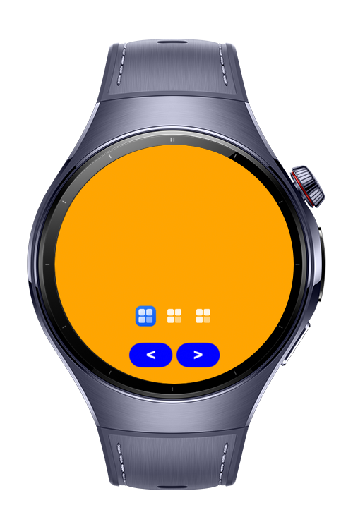
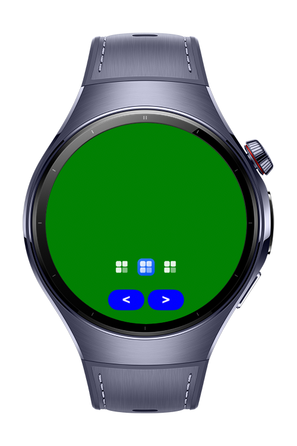
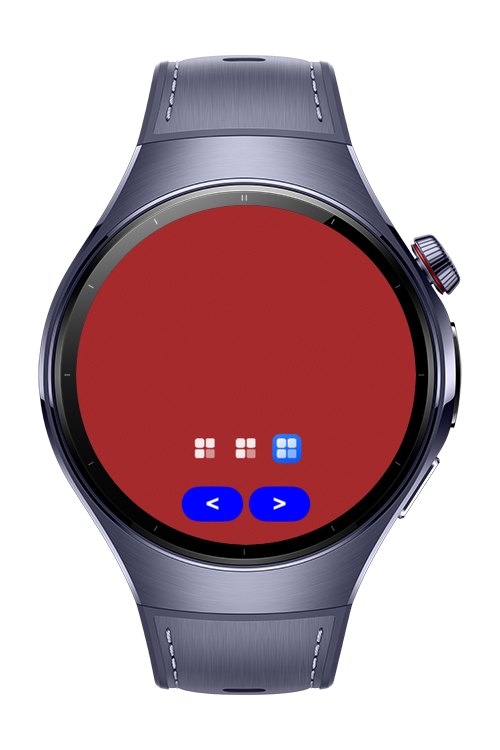

> **Note:** To access all shared projects, get information about environment setup, and view other guides, please visit [Explore-In-HMOS-Wearable Index](https://github.com/Explore-In-HMOS-Wearable/hmos-index).

# How To Implement Custom Image Based Swiper Indicators

This codelab shows how to change swiper indicators with custom image on HarmonyOS.

# Preview
<div>
    
    
    
    
</div>

# Use Cases
- Using Stack to overlay custom image indicators
- Managing state for active/inactive indicators
- Handling swiper events to update indicator state

# Tech Stack
- **Languages**: ArkTS, ArkUI
- **Frameworks**: HarmonyOS SDK 6.1.1(24)
- **Tools**: DevEco Studio 6.1.1.300
- **Libraries**: @kit.ArkUI

# Directory Structure
```
entry/src/main/ets/
├── entryability
│    └── EntryAbility.ets
├── entrybackupability
│    └── EntryBackupAbility.ets
└── pages
     └── Index.ets
```

# Constraints and Restrictions
## Supported Device
- HarmonyOS devices (e.g. Huawei Watch 5, compatible phones/emulators)

# License
**How to implement custom image based swiper indicators** is distributed under the terms of the MIT License.  
See the [LICENSE](LICENSE) file for more information.